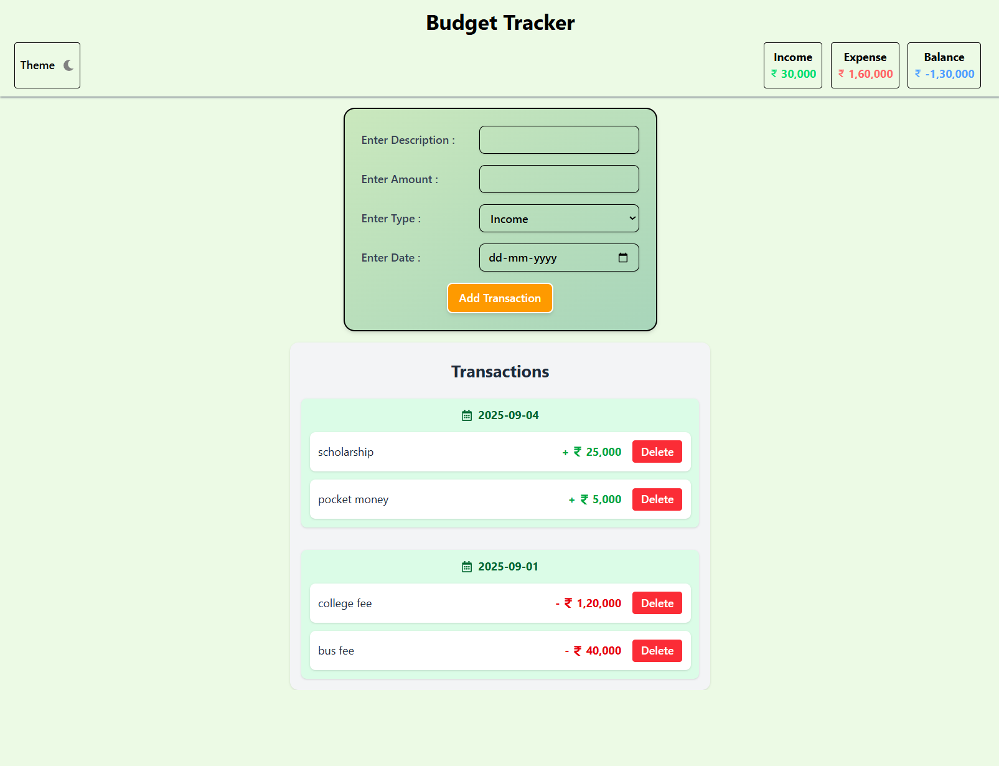
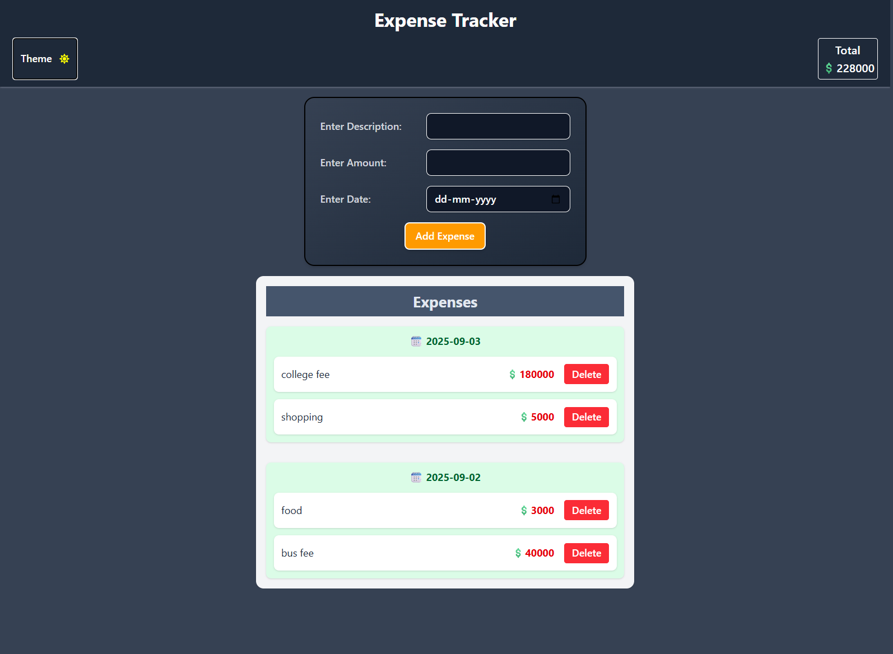

# Expense Tracker App

A simple **Expense Tracker** web application built with **React** and **Tailwind CSS**.  
Track your expenses, set your balance, and see your spending organized by date. Supports **dark mode**.

## 🚀 Live Demo

👉 [Click here to view the app](https://react-budget-tracker-three.vercel.app/)

## 🖼️ Screenshots

| Light Mode                                  | Dark Mode                                 |
| ------------------------------------------- | ----------------------------------------- |
|  |  |

## Features

- **Add Expenses**: Add an expense with amount, category, and date.
- **Set Balance**: Keep track of your available balance.
- **List Expenses by Date**: Expenses are grouped by date for easy tracking.
- **Delete Expenses**: Remove any expense if needed.
- **Dark Mode Support**: Switch between light and dark themes.
- **Responsive Design**: Works on both mobile and desktop.
- **Local Storage**: Your data persists in the browser.

## How to Use

1. **Open the App**: Launch the app in your browser.
2. **Set Your Balance**: Enter your total available balance.
3. **Add an Expense**:
   - Enter the **amount** spent.
   - Choose a **category** (like Food, Transport, Entertainment, etc.).
   - Pick the **date** of the expense.
   - Click **Add**.
4. **View Expenses**:
   - Expenses are grouped by date.
   - Scroll to see all entries.
5. **Delete Expenses**: Click the **delete button** next to an expense to remove it.
6. **Switch Theme**: Use the dark mode toggle to switch between light and dark themes.

## Installation & Setup

# Clone the repo

git clone https://github.com/your-username/expense-tracker.git

# Navigate to the project

cd expense-tracker

# Install dependencies

npm install
npm i react-icons

# Start the development server

npm run dev
The app should now be running at http://localhost:5173.

Tech Stack

React

Tailwind CSS

Vite (for fast development)

Local Storage (to save expenses & balance)

Future Improvements
Add charts to visualize spending by category.

Add export/import data functionality.

Add notifications for overspending.

License
MIT © [Hafeez mohammad]
